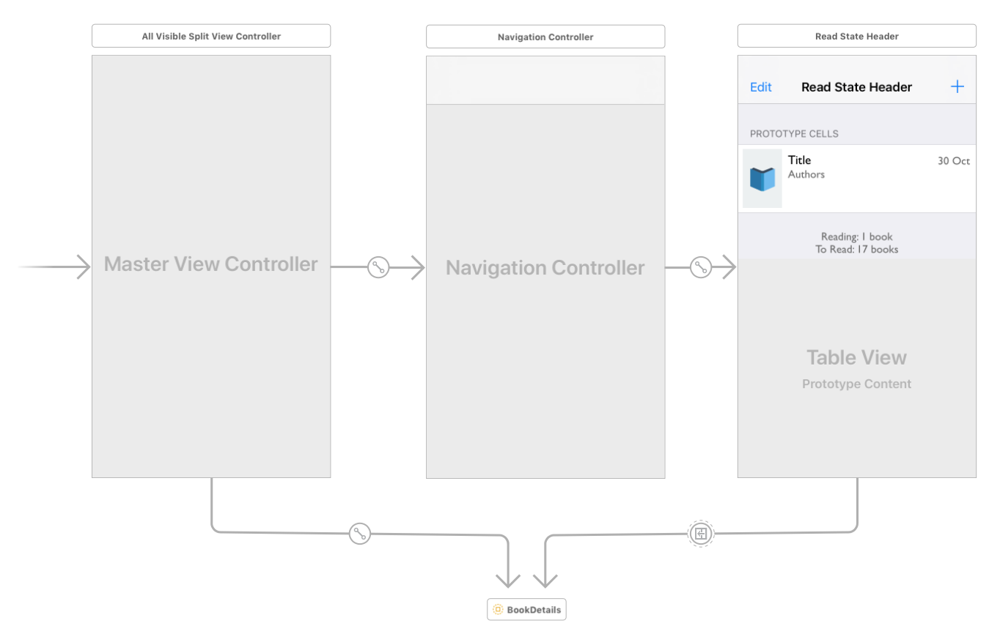
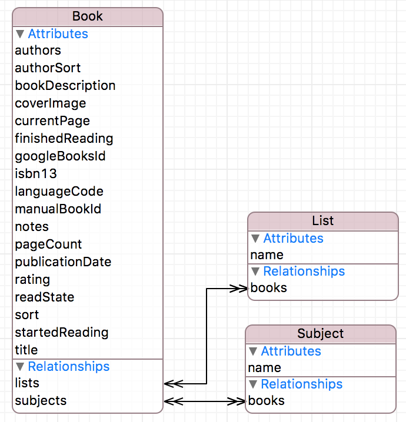

# Reading List

[Reading List](https://www.readinglist.app) is a free, open source iOS app for iPhone and iPad. Reading List allows users to track and catalog the books they read.

</img>

## Requirements
 - Xcode 9.4

## Dependencies
Reading List uses [CocoaPods](https://cocoapods.org/) for including third-party libraries, and [fastlane](https://fastlane.tools/) to automate some processes. To install the correct versions, run:

    gem install bundler
    bundler install
    pod install

## Architecture
Reading List is written in Swift, and primarily uses Apple provided technologies.

### UI
Reading List mostly uses [storyboards](https://developer.apple.com/library/content/documentation/General/Conceptual/Devpedia-CocoaApp/Storyboard.html) for UI design (see below); a limited number of user input views are built using [Eureka](https://github.com/xmartlabs/Eureka) forms.

### Data persistence
Reading List uses [Core Data](https://developer.apple.com/documentation/coredata) for data persistence. There are three entities used in Reading List: `Book`, `Subject` and `List`. The attributes and relations between then are illustrated below:

